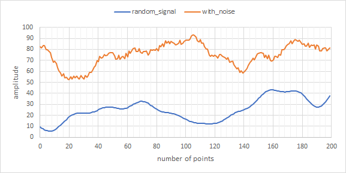
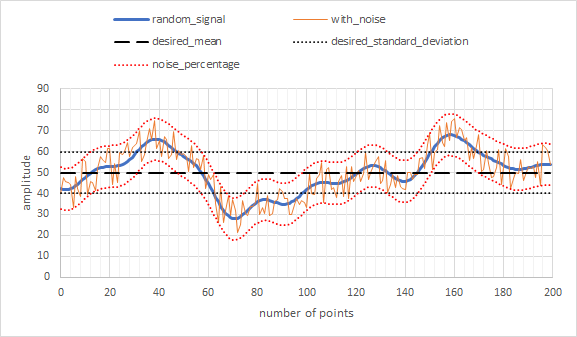
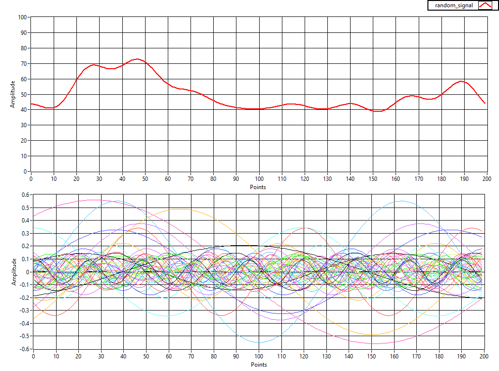

# random_signal_generator

random_signal_generator is a c++ package that generates smooth, random data signals.



This pacakge includes:
1. A library for integrating with your own code
2. An executable for generating signals directly from the command line

Randomly generated signals are useful data sets for testing and tuning algorithms.  Common applications include:
- Machine Learning
- Signal Processing
- Control Theory
- Forecasting

**License:** [MIT](https://choosealicense.com/licenses/mit/)

## Table of Contents:
1. [Download](#download): Where to download the source code from.
2. [Installation](#installation): How to install the utility on your system.
3. [Usage](#usage): How to use this package's library in your code or executable on the command line.
4. [How It Works](#howitworks): Explains how the random signals are generated.

## 1: Download <a id="downlad"/>

**Stable Release**: <https://github.com/pcdangio/random_signal_generator/releases/latest>

**Latest Source**: <https://github.com/pcdangio/random_signal_generator/archive/master.zip>

**GitHub Repository**: <https://github.com/pcdangio/random_signal_generator>

## 2: Installation <a id="installation"></a>

First, download the latest source code from [GitHub](https://github.com/pcdangio/random_signal_generator/releases).

Next, run the following commands in the repo's directory to build the package from source and install it to your system:

```bash
mkdir build
cd build
cmake ..
make
sudo make install
```

This will build and install the library and executable to the default CMAKE_INSTALL_PREFIX path, which is:
- **Linux:** ```/usr/local```
- **Windows:** ```C:/Program Files/random_signal_generator```

You may change the install path by passing ```-DCMAKE_INSTALL_PREFIX "some_path"``` when calling cmake.

## 3: Usage <a id="usage"></a>

This section will explain how to use the library and executable included in this package.  Full documentation of the code, including the library interface, can be found here: <https://pcdangio.github.io/doc/utilities/random_signal_generator/index.html>

### 3.1: Using the Library:

The following example displays how to use the library in your own code.  Full documentation of the library can be found here

**Code**

```cpp
#include <pcd/random_signal_generator.h>

int main(int argc, char** argv)
{
    // These parameters are required for every random_signal_generator:
    // - n_points: Controls the length of the signal as a number of points.
    // - desired_mean: The desired average "y" value of the signal.
    // - desired_standard_deviation: The desired spread of "y" values in the random signal.
    int n_points = 200;
    double desired_mean = 35;
    double desired_standard_deviation = 1;

    // Instantiate a random_signal_generator.
    pcd::random_signal_generator rsg(n_points, desired_mean, desired_standard_deviation);

    // The required parameters listed above can be changed at any time if desired:
    // rsg.n_points = 200;
    // rsg.desired_mean = 42.6;
    // rsg.desired_standard_deviation = 5.0;

    // The following parameters are optional, and can be set/changed at any time. See documentation for full explanations.
    // rsg.n_bases: The number of basis vectors used to generate the random signal. Default value is 50.
    // rsg.max_frequency: The maximum possible frequency (in Hz) of the basis vectors. Default value is 10.0 Hz.
    // rsg.noise_percentage: The amount of Guassian noise to add to the random signal, as a decimal percentage of the desired standard deviation. Default value is 0.

    // Generate the random signal.
    // First, create an empty vector for storing the generated signal.
    std::vector<double> random_signal;
    // Next, use the utility to actually generate the signal and populate it in the vector.
    rsg.generate(random_signal);

    // random_signal now contains a vector of points that represent the generated random signal.

    return 0;
}
```

**Figure 2** below shows how each of the parameters affects the shape of the generated signal.  In this scenario, n_points = 200, desired_mean = 50, desired_standard_deviation = 10, and noise_percentage = 1.0 (100% of desired_standard_deviation).



**Compiling**

The following example shows how to build your project on Linux and link it against the pcd-random_signal_generator static library:

__NOTE__ This example assumes that you have installed the library and it's headers to a location on your library PATH.

```cmake
cmake_minimum_required(VERSION 3.5)

project(my_program_name)

add_executable(my_executable_name main.cpp)
target_link_libraries(my_executable_name libpcd-random_signal_generator.a)
```

### 3.2: Command Line Executable

This package installs an executable named ```random_signal_generator``` on your system.  By default, it should be installed within your PATH, so you should be able to call it directly after installation.

The following code snippet illustrates how the executable should be used:
```bash
$ random_signal_generator -h
A command line tool for generating random signals.
Usage:
  random_signal_generator [OPTION...]

  -p, --n_points arg            The length of the generated signal in data
                                points. DEFAULT: 100
  -m, --desired_mean arg        The desired mean amplitude of the generated
                                signal. DEFAULT: 25.0
  -d, --desired_standard_deviation arg
                                The desired standard deviation in the
                                amplitude of the generated signal. DEFAULT: 10.0
  -b, --n_bases arg             The number of bases to use for generating the
                                signal. DEFAULT: 50
  -f, --max_frequency arg       The maximum frequency of the generated signal
                                over number of points specified. DEFAULT:
                                10.0
  -n, --noise_percentage arg    The amount of Gaussian noise to add as a
                                percentage of the desired standard deviation.
                                DEFAULT: 0.0
  -o, --output_file arg         The desired CSV output file to write the
                                signal to. If not specified, outputs to screen.
  -s, --n_signals arg           The number of random signals to generate.
                                DEFAULT: 1
  -h, --help                    Display help.
```

The following code snippet illustrates two example use cases:
```bash
# Generate 100 points with a mean value of 15.5 and a standard deviation of 1.5.  Write output directly to terminal.
$ random_signal_generator -p 100 -m 15.5 -d 1.5
Generating signal 1 of 1...
Done generating signals.
Writing to console...
15.648552
15.637029
15.654356
... (points cut from example for brevity)
13.107777
Done.

# Generate 4 different random signals with 100 points, a mean of 15.5, standard deviation of 1.5, and noise percentage of 0.25.  Write output to a CSV file.
$ random_signal_generator -s 4 -p 100 -m 15.5 -d 1.5 -n 0.25 -o my_signals.csv
Generating signal 4 of 4...
Done generating signals.
Writing to file "my_signals.csv"...
Done.
```

## 4: How It Works <a id="howitworks"></a>

This utility leverages Fourier Composition to generate random signals.

[Fourier Series](https://en.wikipedia.org/wiki/Fourier_series) analysis can be used to decompose any periodic signal into an infinite number of sine waves.  It then stands that you can use a series of sine waves to compose a new signal.  The random_signal_generator library uses this concept to generate pseudo-random signals.  The algorithm generates a series of random sine waves, which are then combined into a new signal.

Random sine waves are calculated by choosing a random amplitude, frequency, and phase offset for each wave.  It is important to note that this algorithm differs from standard Fourier Composition in that the sine waves are NOT harmonic.  This limitation allows for non-periodic random signals to be generated.  Another feature of this algorithm is that lower frequency waves tend to have higher amplitude, which gives more base structure to the generated signal (e.g. rising, falling, etc.).

Once the random sine waves are generated, they are superimposed (added) together to create the random signal that is output by the utility.  An example is provided in **Figure 3** below:


